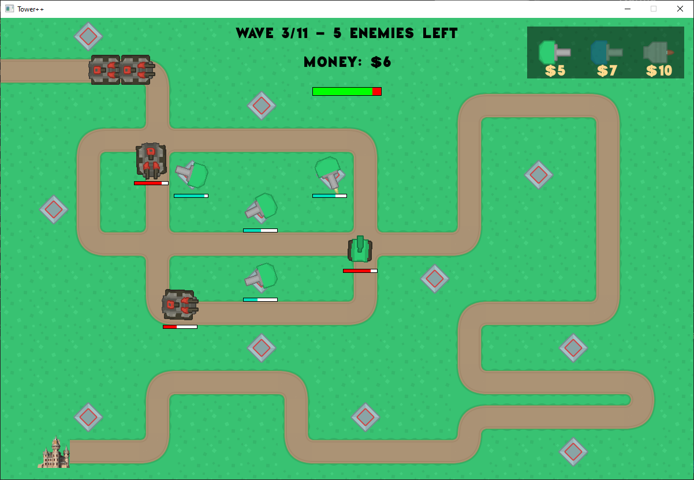

(projet visual studio)

## Commentaire
Je suis un peu embêté car je n'ai pas grand chose à dire ! Le code est clair et facilement abordable (point de vue du correcteur). Chaque élément est à sa place et fonctionne bien. Les concepts du C++ vus en cours sont bien appliqués.

Dommage de ne pas avoir un système d'upgrade plus "visuel". Il aurait été bon d'avoir un peu plus peaufiné l'expérience de jeu (équilibrage) afin de mettre en avant le travail accompli.

Très bon travail dans l'ensemble, n'hésitez pas à revenir vers moi si vous souhaitez avoir un avis plus précis sur un point du code que vous voudriez améliorer/changer.

## Compilation
- Ne compile pas (manque le .user)
- Après l'ajout du fichier, compilation OK 👍

## Visuel

## Features
- Jouable ! 👍
- Une règle particulière : disparition des tours si on ne clic pas dessus...
- Le système d'upgrade est implémenté, mais pas clair pour le joueur.
- Différents types de tours OK
- Tirs (avec mouvement/instantané) fonctionnels 👍
- Vie des ennemis 👍
- Vie du joueur 👍
- Shop 👍
- Game over 👍
- Chemin complexe (système de node) 👍
- Chargement map par fichier externe 👍
- Fichier de spawn pattern !

## C++/Héritage
- Héritage bien utilisé
- Utilisation du polymorphisme présent (avec override)
- Const correctness OK
- Passage par référence (const lorsque c'est nécessaire)
- Encapsulation OK

## Logique/Code
- Boucle principale claire
- Système de spawn pattern ingénieux
- Il y a moyen de réduire/simplifier la fonction `generateTilemap()/interpretTile()` !

## Norme
- Quelques incohérences au niveau des minuscules/majuscules (m_max_life et m_shouldDestroy)
- Bien respectée en règle générale.